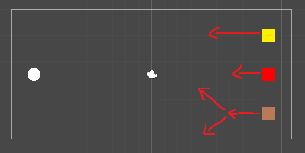
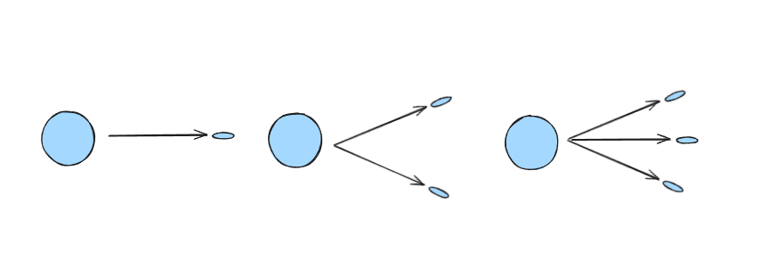

# 2D Shooting Game

The task of this test is to implement a very basic 2D shooting game.

## Technical Aspect

For the technical aspect of this test, please implement the game as per the following specification:

The mechanics of the game are as follows:
- The player controls a spaceship (circle) and can move around within the boundaries of the screen by using either WASD or the arrow keys.
- Enemies will keep spawning at random on the right side of the screen. There are 3 types of enemies:
    - Red Square: Move in a straight line to the left.
    - Yellow Square: Move in a straight line to the left at double speed.
    - Asteroid: Move in a straight line to the left. When destroyed, splits into 2 separate small asteroids (45 degrees up/down). Small asteroids explode when hit again.

- By pressing SPACE the player can shoot projectiles that will move in a straight line into the direction they are shot. The projectile count and direction depends on the weapon level.
    - Single Shot: Shoots a single projectile to the right.
    - Split Shot: Shoots two projectiles, each in a 30 degree angle up and down.
    - Triple Shot: Shoots three projectiles, combining the single and split shot.

- When a projectile hits an enemy, the enemy will be destroyed and the player receives 100 points.
- When an enemy gets destroyed, there is a 20% chance for an item to drop. There are 3 different types of items that drop with uniform distribution.
    - Points: Increases score by 50.
    - Weapon Upgrade: Upgrades the ship weapon to the next level. If at maximum level, there is no effect.
    - Shield Upgrade: Spaceship becomes invincible for 5 seconds.
- When a dropped item touches the player's spaceship, it will be collected and its effect will be activated.
- When an enemy touches the player's spaceship (and they are not invincible), the game ends. An overlay with the final score will be displayed.
- Pressing the SPACE button on the end screen will restart the game.
- The current score is displayed in the top right corner.

The game is in a prototyping stage. Keep this in mind, when building the game.

## Art Aspect

For the art aspect of this test, please make the game look like a proper game by adding visual effects and sound effects. The design will be up to you and you are free to use any free-to-use assets that you can find on the internet.
